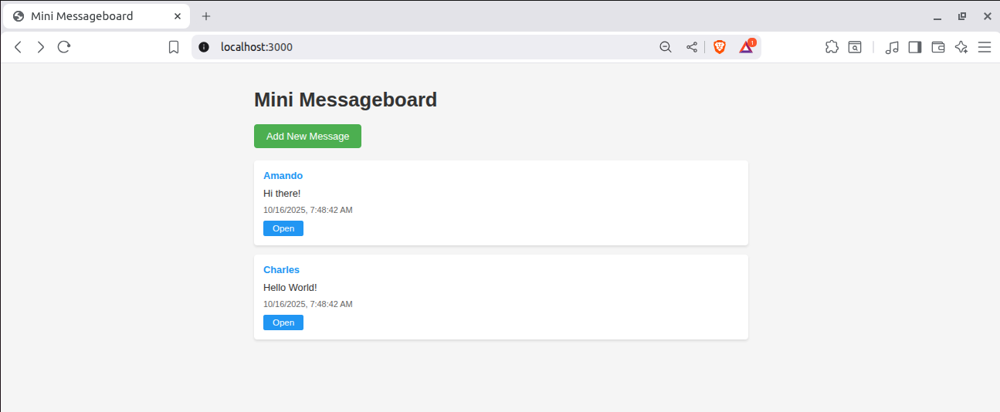

# 📬 Mini Messageboard

### **A simple, elegant message board application built with Node.js, Express, and EJS following the MVC architecture pattern.**



## 🚀 [Live Demo](https://mini-message-board-production-8e5d.up.railway.app/)

## ✨ Features

- 📝 Create and view messages
- 👤 Display message author and timestamp
- 🔍 View detailed information for each message
- 🎨 Clean, responsive UI design
- 🏗️ Built with MVC architecture for maintainability

## 🛠️ Technologies Used

- **Node.js** - JavaScript runtime
- **Express.js** - Web application framework
- **EJS** - Templating engine
- **CSS3** - Styling

## 📁 Project Structure

```
├── app.js                      # Application entry point
└── src/
    ├── models/                 # Data layer
    ├── controllers/            # Business logic
    ├── routes/                 # URL routing
    ├── views/                  # EJS templates
    └── styles/                 # CSS files
```

## 🚦 Getting Started

### Prerequisites

- Node.js (v18 or higher)
- npm

### Installation

1. Clone the repository
```bash
git clone https://github.com/anwangari/Mini-Message-Board.git
cd Mini-Message-Board
```

2. Install dependencies
```bash
npm install express --save
npm install ejs
npm install dotenv
```

3. Start the server
```bash
node app.js
```

4. Open your browser and visit
```
http://localhost:PORT
```

## 📝 Usage

- **View Messages** - Visit the home page to see all messages
- **Add Message** - Click "Add New Message" and fill out the form
- **View Details** - Click "Open" on any message to see full details

## 🏗️ Architecture

This project follows the **MVC (Model-View-Controller)** pattern:

- **Models** - Handle data operations and business rules
- **Views** - Render the user interface with EJS templates
- **Controllers** - Process requests and coordinate between models and views

## 📄 License

This project is open source and available under the [MIT License](LICENSE).

## 👤 Author

**Your Name**
- GitHub: [@anwangari](https://github.com/anwangari)

## 🙏 Acknowledgments

Built as part of [The Odin Project](https://www.theodinproject.com/) curriculum.

---

⭐ Star this repo if you found it helpful!